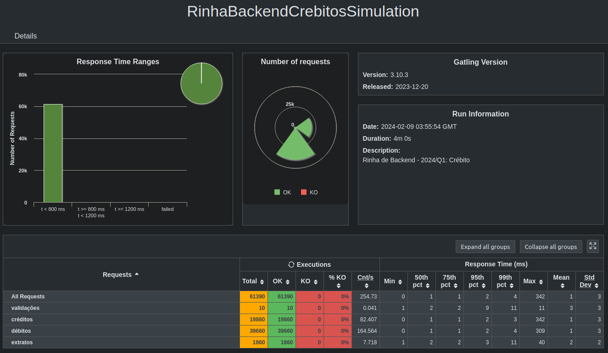

# rinha-crebito-cpp




### Tecnologias utilizadas:
- [C++20](https://en.cppreference.com/w/cpp/20)
- [Drogon Framework](https://github.com/drogonframework/drogon)
- [MariaDB](https://mariadb.org/)

## Rodando o projeto

- Baixar as images e iniciar a composição
```bash
docker compose up -d
```

- Recompilar as imagens
```bash
docker compose build
```

- Reiniciar os dados dos testes
```bash
docker compose down
```

- Executar os testes
```bash
./executar-teste-local.sh
```
